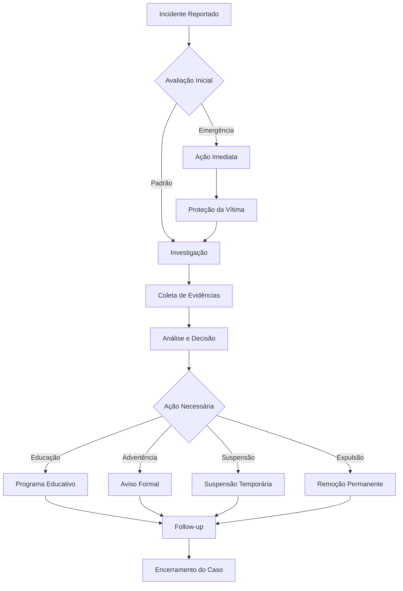

### Resposta a Incidentes

**⚖️ Processo de resolução:**

1. **Avaliação Inicial (24-48 horas)**
- Confirmar recebimento do relato
- Avaliar gravidade e urgência
- Designar equipe de investigação

2. **Investigação (3-7 dias)**
- Coletar evidências e testemunhos
- Entrevistar partes envolvidas
- Analisar contexto e histórico

3. **Ação Imediata (se necessário)**
- Suspensão temporária de acesso
- Remoção de conteúdo inadequado
- Medidas de proteção para vítimas

4. **Resolução Final**
- Decisão baseada em evidências
- Comunicar resultado às partes
- Implementar medidas corretivas

### Possíveis Consequências

**📋 Medidas que podem ser aplicadas:**

1. **Aviso Corretivo**
- Aviso verbal ou escrito
- Requisito de desculpa pública
- Educação sobre o código de conduta

2. **Limitações de Acesso**
- Restrição temporária de certos espaços
- Moderação prévia de contribuições
- Suspensão de privilégios

3. **Suspensão Temporária**
- Banimento temporário (1-30 dias)
- Proibição de participar de eventos
- Remoção de posições de liderança

4. **Expulsão Permanente**
- Banimento permanente do projeto
- Remoção de todas as contribuições
- Notificação a outros projetos (se necessário)

## Apelo

### Para a Comunidade

**🤝 Como podemos ajudar:**

- **Seja um aliado**: Intervenha quando testemunhar comportamento inadequado
- **Eduque-se**: Aprenda sobre diferentes perspectivas e experiências
- **Seja paciente**: Lembre-se que todos estamos aprendendo
- **Dê o benefício da dúvida**: Assuma boa intenção antes de julgar

### Para Indivíduos Afetados

**💚 Apoio disponível:**

- **Recursos Internos**
  - Equipe de moderação treinada
  - Canais privados para suporte
  - Acompanhamento durante o processo

- **Recursos Externos**
  - [Mental Health America](https://mhanational.org/)
  - [Crisis Text Line](https://www.crisistextline.org/)
  - [National Suicide Prevention Lifeline](https://suicidepreventionlifeline.org/)

## Melhoria Contínua

### Revisão do Código de Conduta

**📅 Compromisso com a melhoria:**

- **Revisão Trimestral**: Avaliação de eficácia e relevância
- **Atualização Anual**: Revisão completa com feedback da comunidade
- **Incidentes Significativos**: Revisão ad-hoc após eventos importantes

### Feedback da Comunidade

**📣 Como contribuir para a melhoria:**

1. **Sugestões de Melhoria**
- Email: feedback@video-ai-editor.com
- GitHub Issues: Tag `code-of-conduct`
- Pesquisas anuais da comunidade

2. **Participação no Processo**
- Voluntário para equipe de conduta
- Participação em discussões públicas
- Revisão de propostas de mudança

## Créditos e Agradecimentos

### Inspiração

Este Código de Conduta foi adaptado de:

- [Contributor Covenant](https://www.contributor-covenant.org/)
  - Versão 2.1, disponível em https://www.contributor-covenant.org/version/2/1/code_of_conduct.html
- [Mozilla Code of Conduct](https://www.mozilla.org/en-US/about/governance/policies/participation/)
- [Rails Code of Conduct](https://rubyonrails.org/conduct/)

### Agradecimentos

Agradecemos especialmente a:

- **Equipe de Moderação Voluntária**: Por dedicar tempo para manter nossa comunidade segura
- **Contribuidores Iniciais**: Por ajudar a estabelecer nossos valores fundamentais
- **Comunidade LGBTQIA+**: Por fornecer orientação sobre inclusão e diversidade
- **Mentores de Novatos**: Por criar um ambiente acolhedor para aprendizes

## Licença

Este Código de Conduta está licenciado sob [Creative Commons Attribution-ShareAlike 4.0 International License](https://creativecommons.org/licenses/by-sa/4.0/).

## Contato e Informações Adicionais

### Equipe de Conduta

**👥 Nossa equipe dedicada:**

| Nome | Função | Contato | Fuso Horário |
|------|--------|---------|--------------|
| Lucas Witchemichen | Fundador, CTO & Desenvolvedor | +5542988442535
### Canais de Comunicação

**📞 Onde nos encontrar:**

- **Emergências**: conduct@luwieditorai.xyz (resposta em 24h)
- **Questões Gerais**: community@luwieditorai.xyz (resposta em 48h)

### Recursos Adicionais

**📚 Materiais de aprendizado:**

- **Inclusão em Tecnologia**
  - [The Ally Toolkit](https://www.theallytoolkit.com/)
  - [Diversity in Tech](https://diversityintech.co/)
  - [Tech Inclusion](https://techinclusion.co/)

- **Comunicação Inclusiva**
  - [Inclusive Language Guide](https://inclusive-style-guide.com/)
  - [Gender Pronouns Guide](https://www.mypronouns.org/)
  - [Cultural Competence Resources](https://www.hhs.gov/civil-rights/for-individuals/special-topics/national-origin/cultural-competence.html)

- **Resolução de Conflitos**
  - [Nonviolent Communication](https://www.cnvc.org/)
  - [Crucial Conversations](https://crucialconversations.com/)
  - [Difficult Conversations](https://difficultconversations.com/)

## Perguntas Frequentes (FAQ)

### ❓ Perguntas Comuns

**Q: O que acontece se eu cometer um erro?**
A: Todos cometemos erros! Se você cometer um erro, peça desculpas sinceramente, aprenda com a experiência e comprometa-se a fazer melhor no futuro. Estamos aqui para ajudar todos a crescer.

**Q: Como sei se algo é apropriado dizer?**
A: Uma boa regra é: se você não diria isso para um colega de trabalho em um ambiente profissional, provavelmente não é apropriado aqui. Quando em dúvida, seja gentil e respeitoso.

**Q: O código de conduta se aplica a conversas privadas?**
A: Sim, quando as conversas privadas envolvem membros da comunidade e estão relacionadas ao projeto. O objetivo é manter um ambiente seguro em todos os espaços.

**Q: Posso expressar opiniões políticas?**
A: Discussões políticas são permitidas quando relevantes para o projeto ou comunidade, mas devem ser conduzidas de forma respeitosa, sem ataques pessoais ou discurso de ódio.

**Q: Como lido com alguém que está violando o código de conduta?**
A: Não se sinta obrigado a confrontar diretamente. Reporte a situação para nossa equipe de conduta, que irá lidar com isso de forma apropriada e confidencial.

### 🎯 Cenários Específicos

**Cenário 1: Novo Contribuidor Faz uma Pergunta "Básica"**
```
❌ Resposta inadequada:
"Isso é óbvio, só ler a documentação."

✅ Resposta adequada:
"Ótima pergunta! Isso pode ser confuso no início. Vou te mostrar como fazer isso passo a passo..."
```

**Cenário 2: Discussão Técnica Aquecida**
```
❌ Comportamento inadequado:
"Sua abordagem está completamente errada e vai quebrar tudo."

✅ Comportamento adequado:
"Entendo sua perspectiva. Tenho algumas preocupações sobre essa abordagem. Podemos discutir alternativas?"
```

**Cenário 3: Feedback Crítico**
```
❌ Feedback inadequado:
"Seu código está terrível e não funciona."

✅ Feedback adequado:
"Notei alguns problemas nesta parte do código. Aqui estão algumas sugestões de como podemos melhorá-lo..."
```

## Compromisso com a Diversidade e Inclusão

### Nossos Valores Fundamentais

**🌈 O que valorizamos:**

1. **Diversidade de Perspectivas**
   - Diferentes origens trazem diferentes soluções
   - Experiências diversas enriquecem nosso produto
   - Múltiplas visões levam a decisões melhores

2. **Acessibilidade Universal**
   - Nosso código deve ser acessível a todos os níveis de habilidade
   - Nossa documentação deve ser compreensível globalmente
   - Nossa comunidade deve ser acolhedora para todos

3. **Equidade de Oportunidades**
   - Todos devem ter direito igual de contribuir
   - Reconhecimento baseado em mérito e contribuição
   - Remoção de barreiras sistemáticas

### Iniciativas Específicas

**🚀 Programas atuais:**

- **Mentoria para Novatos**: Pareamento de novos contribuidores com mentores experientes
- **Bolsas de Participação**: Suporte financeiro para participantes de comunidades sub-representadas
- **Tradução de Documentação**: Esforço contínuo para traduzir documentação para múltiplos idiomas
- **Horários de Reunião Inclusivos**: Alternância de horários para acomodar diferentes fusos horários

### Métricas e Responsabilidade

**📊 Como medimos nosso progresso:**

- **Demografia da Comunidade**: Pesquisas anuais (opcionais e anônimas)
- **Taxa de Retenção**: Acompanhamento de novos contribuidores
- **Diversidade de Contribuições**: Análise de tipos e origens de contribuições
- **Satisfação da Comunidade**: Feedback regular sobre o ambiente da comunidade

## Guia de Resposta a Incidentes

### Fluxograma de Resposta



### Templates de Resposta

**📧 Template de Confirmação Inicial:**
```
Assunto: Recebemos seu relato - Código de Conduta

Olá [Nome],

Obrigado por nos contatar sobre esta situação. Recebemos seu relato e o levamos muito a sério.

Nossa equipe de conduta irá revisar seu relato e entraremos em contato em até 24 horas com próximos passos.

Se você estiver em perigo imediato, por favor contate as autoridades locais ou linhas de apoio.

Com carinho,
Equipe de Conduta do Video AI Editor
```

**📧 Template de Resolução:**
```
Assunto: Atualização sobre seu relato - Código de Conduta

Olá [Nome],

Gostaríamos de atualizá-lo sobre a situação que você reportou em [Data].

[Descrição da ação tomada]

Estamos comprometidos em manter um ambiente seguro para todos os membros de nossa comunidade. Se você tiver alguma preocupação adicional ou precisar de suporte, por favor não hesite em nos contatar.

Agradecemos sua coragem ao reportar esta situação.

Atenciosamente,
Equipe de Conduta do Video AI Editor
```

## Recursos de Saúde Mental

### Apoio Emergencial

**🆘 Se você ou alguém que você conhece está em crise:**

- **Linha de Prevenção ao Suicídio**: 988 (EUA) ou +1 800 273 8255
- **Crisis Text Line**: Texte HOME para 741741
- **Internacional**: https://findahelpline.com/

### Bem-Estar Digital

**💚 Práticas saudáveis de participação online:**

1. **Estabeleça Limites**
   - Defina horários para participar da comunidade
   - Faça pausas regulares das redes sociais
   - Desconecte-se quando precisar

2. **Cuide de Si Mesmo**
   - Priorize seu bem-estar mental
   - Busque apoio quando necessário
   - Lembre-se que está tudo bem não estar bem

3. **Comunidade Solidária**
   - Apoie outros membros que possam estar struggling
   - Compartilhe recursos de saúde mental
   - Crie um ambiente onde vulnerabilidade é aceita

## Histórico de Mudanças

### Versões do Documento

- **v2.0** - 15 de Janeiro de 2024
  - Adição de seção de recursos de saúde mental
  - Expansão de exemplos práticos
  - Inclusão de métricas de responsabilidade

- **v1.5** - 1 de Dezembro de 2023
  - Adição de fluxograma de resposta
  - Templates de comunicação
  - Seção de FAQ expandida

- **v1.0** - 1 de Junho de 2023
  - Versão inicial baseada no Contributor Covenant 2.1
  - Adaptação para necessidades específicas do projeto

## Declaração de Compromisso

Nós, como mantenedores, contribuidores e membros da comunidade do Video AI Editor, nos comprometemos a:

✅ **Criar e manter um ambiente seguro e inclusivo** para todos os participantes, independentemente de suas características pessoais ou背景.

✅ **Tratar todas as pessoas com dignidade e respeito**, reconhecendo o valor inerente de cada indivíduo e suas contribuições únicas.

✅ **Responder pronta e adequadamente a todas as preocupações** sobre comportamento inadequado, tomando ações apropriadas para proteger nossa comunidade.

✅ **Aprender e crescer continuamente**, buscando entender melhor as necessidades de nossa comunidade diversificada e melhorando nossas práticas.

✅ **Ser transparentes sobre nossos processos**, mantendo nossa comunidade informada sobre como estamos trabalhando para tornar este espaço melhor para todos.

---

## Juntos Somos Mais Fortes

Este código de conduta é mais do que um conjunto de regras - é uma declaração de nossos valores compartilhados e nosso compromisso coletivo de construir uma comunidade tecnológica melhor, mais inclusiva e mais acolhedora.

Cada um de nós tem um papel a desempenhar na criação deste ambiente. Juntos, podemos fazer do Video AI Editor um lugar onde todos se sintam bem-vindos, valorizados e capacitados a contribuir com seu melhor trabalho.

**Lembre-se: por trás de cada avatar, cada linha de código e cada comentário, há uma pessoa real com sentimentos, experiências e perspectivas únicas. Vamos tratar uns aos outros com a gentileza, respeito e empatia que todos merecemos.**

---

<div align="center">
  <sub>
    🌈 Este Código de Conduta é um documento vivo, 
    evoluindo com nossa comunidade. 
    Sua contribuição para sua melhoria é sempre bem-vinda.
  </sub>
</div>

<div align="center">
  <sub>
    Última atualização: 15 de Janeiro de 2024
    <br>
    Próxima revisão programada: 15 de Abril de 2024
  </sub>
</div>
```

**Commit Message:**
```
docs(conduct): add comprehensive code of conduct with enforcement procedures

- Define clear behavioral expectations and community standards
- Add detailed incident reporting and response procedures
- Include contact information for conduct team and support resources
- Add FAQ section with practical examples and scenarios
- Include diversity and inclusion initiatives and metrics
- Add mental health resources and wellbeing guidelines
- Include historical changes and version tracking

This document ensures a safe, inclusive, and welcoming environment
for all contributors and users of the Video AI Editor project.
```

## 🎯 Principais Características

### 1. **Abrangente e Detalhado**
- Define claramente comportamentos aceitáveis e inaceitáveis
- Inclui exemplos práticos e cenários específicos
- Aborda diversas situações e contextos

### 2. **Processo Claro**
- Fluxograma visual de resposta a incidentes
- Templates de comunicação prontos
- Prazos definidos para cada etapa

### 3. **Foco em Bem-Estar**
- Recursos de saúde mental
- Apoio para vítimas
- Práticas saudáveis de participação online

### 4. **Compromisso com Diversidade**
- Iniciativas específicas de inclusão
- Métricas de responsabilidade
- Recursos para aprendizado contínuo

### 5. **Documento Vivo**
- Histórico de mudanças
- Agenda de revisões regulares
- Canais para feedback da comunidade

Este código de conduta vai além do básico, criando um ambiente verdadeiramente seguro e acolhedor para todos os participantes do projeto!
