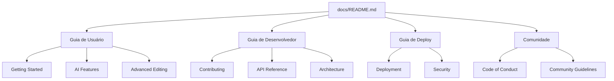

# 📚 Video AI Editor Documentation

Bem-vindo à documentação oficial do Video AI Editor! Este portal contém todos os recursos necessários para entender, usar, contribuir e implantar o editor de vídeo com IA.

## 🗂️ Índice da Documentação

### 🚀 Para Usuários

Se você está começando a usar o Video AI Editor, comece por aqui:

- [**Guia de Início Rápido**](user-guide/getting-started.md)  
  📖 Aprenda os conceitos básicos e crie seu primeiro vídeo em minutos

- [**Recursos de IA**](user-guide/ai-features.md)  
  🤖 Domine as ferramentas de inteligência artificial e crie vídeos incríveis

- [**Edição Avançada**](user-guide/advanced-editing.md)  
  🎨 Explore técnicas avançadas e recursos profissionais

### 👨‍💻 Para Desenvolvedores

Se você deseja contribuir com o código ou integrar com nossa API:

- [**Guia de Contribuição**](CONTRIBUTING.md)  
  🤝 Aprenda como contribuir para o projeto

- [**API Reference**](API.md)  
  🔌 Documentação completa da API REST e WebSocket

- [**Arquitetura do Sistema**](architecture.md)  
  🏗️ Entenda a estrutura interna e design do sistema

### 🛠️ Para DevOps e Administradores

Se você precisa implantar ou manter o sistema:

- [**Guia de Deploy**](DEPLOYMENT.md)  
  🚀 Instruções detalhadas para implantação em diferentes ambientes

- [**Política de Segurança**](SECURITY.md)  
  🔒 Diretrizes de segurança e procedimentos de relatório

### 📋 Para a Comunidade

Recursos para manter nossa comunidade saudável e produtiva:

- [**Código de Conduta**](CODE_OF_CONDUCT.md)  
  ✅ Diretrizes de comportamento para todos os participantes

## 🎯 Início Rápido

### Novo Usuário?

1. Leia o [Guia de Início Rápido](user-guide/getting-started.md)
2. Experimente os [Recursos de IA](user-guide/ai-features.md)
3. Explore a [Edição Avançada](user-guide/advanced-editing.md)

### Novo Contribuidor?

1. Leia o [Guia de Contribuição](CONTRIBUTING.md)
2. Entenda a [Arquitetura do Sistema](architecture.md)
3. Consulte a [API Reference](API.md)

### Precisa de Ajuda?

- 🐛 [Reportar um Bug](https://github.com/video-ai-editor/video-ai-editor/issues/new?assignees=&labels=bug&template=bug_report.md)
- 💡 [Sugerir uma Funcionalidade](https://github.com/video-ai-editor/video-ai-editor/issues/new?assignees=&labels=enhancement&template=feature_request.md)
- 💬 [Discussões da Comunidade](https://github.com/video-ai-editor/video-ai-editor/discussions)
- 📧 [Contato Direto](mailto:support@video-ai-editor.com)

## 🗺️ Mapa de Navegação



## 📊 Estatísticas da Documentação

| Seção | Documentos | Última Atualização |
|--------|------------|-------------------|
| 📖 Guia de Usuário | 3 docs | {{ git_commit_date }} |
| 👨‍💻 Guia de Desenvolvedor | 3 docs | {{ git_commit_date }} |
| 🛠️ Guia de Deploy | 2 docs | {{ git_commit_date }} |
| 📋 Comunidade | 1 doc | {{ git_commit_date }} |
| **Total** | **9 docs** | **{{ git_commit_date }}** |

## 🔍 Como Encontrar Informações

### Por Papel
- **Usuários Finais**: Guia de Usuário → Getting Started
- **Desenvolvedores**: Guia de Desenvolvedor → Contributing
- **DevOps**: Guia de Deploy → Deployment
- **Gerentes de Projeto**: API Reference + Architecture

### Por Tarefa
- **Aprender a Usar**: Getting Started → AI Features
- **Contribuir Código**: Contributing → Architecture → API
- **Implantar**: Deployment → Security
- **Integrar**: API Reference → Architecture

### Por Problema
- **Erro na Instalação**: Deployment → Troubleshooting
- **Bug na Aplicação**: Contributing → Bug Reports
- **Dúvida sobre API**: API Reference → Examples
- **Problema de Segurança**: Security → Reporting

## 📝 Como Contribuir com a Documentação

Agradecemos contribuições para melhorar nossa documentação! Aqui estão algumas maneiras de ajudar:

### Tipos de Contribuição

- 📝 **Correções**: Erros de digitação, links quebrados, informações desatualizadas
- 📖 **Melhorias**: Clareza, exemplos adicionais, melhores explicações
- 🆕 **Novo Conteúdo**: Guias, tutoriais, estudos de caso
- 🌐 **Traduções**: Ajude a traduzir a documentação para outros idiomas

### Processo

1. **Fork o Repositório**
2. **Crie uma Branch**: `git checkout -b docs/nome-da-melhoria`
3. **Faça as Mudanças**
4. **Siga o Guia de Estilo**: Use Markdown claro e consistente
5. **Crie um Pull Request**: Descreva suas melhorias

### Guia de Estilo

- Use headers `#`, `##`, `###` para hierarquia
- Use **negrito** para ênfase
- Use `código` para termos técnicos
- Use > para blocos de citação
- Use listas numeradas para passos
- Use emojis moderadamente para melhor visualização

## 🔄 Manutenção da Documentação

### Agenda de Revisão

- **Mensal**: Verificar links quebrados e atualizar versões
- **Trimestral**: Revisar conteúdo para precisão e relevância
- **Semestral**: Reestruturação baseada em feedback do usuário

### Responsabilidades

- **Maintainers**: Revisão e aprovação de mudanças
- **Contribuidores**: Criação e atualização de conteúdo
- **Comunidade**: Feedback e sugestões de melhoria

## 📈 Métricas e Feedback

### Como Medimos o Sucesso

- 📊 **Visualizações**: Acessos à documentação
- ⏱️ **Tempo na Página**: Engajamento do conteúdo
- 🐛 **Issues Relacionadas**: Problemas reportados na documentação
- 👍 **Feedback**: Avaliações e sugestões dos usuários

### Feedback

- Use o botão "👍/👎" no final de cada página
- Abra uma issue com a tag `documentation`
- Participe das [discussões](https://github.com/video-ai-editor/video-ai-editor/discussions)

## 🔗 Recursos Externos

### Ferramentas Recomendadas

- **Editor**: [VS Code](https://code.visualstudio.com/) com extensão Markdown
- **Visualização**: [Markdown Preview Enhanced](https://marketplace.visualstudio.com/items?itemName=shd101wyy.markdown-preview-enhanced)
- **Linter**: [markdownlint](https://github.com/DavidAnson/markdownlint)

### Referências

- [GitHub Flavored Markdown](https://guides.github.com/features/mastering-markdown/)
- [Mermaid Syntax](https://mermaid-js.github.io/)
- [Documentação de Código Aberto](https://opensource.guide/)

---

## 🤝 Precisa de Ajuda?

Se você não conseguir encontrar o que está procurando ou tiver sugestões para melhorar esta documentação:

- 📧 **Email**: docs@video-ai-editor.com
- 💬 **Discord**: [Canal #documentation](https://discord.gg/video-ai-editor)
- 🐙 **GitHub**: [Issues](https://github.com/video-ai-editor/video-ai-editor/issues)

---

<div align="center">
  <sub>
    📚 Documentação mantida com ❤️ pela 
    <a href="https://github.com/video-ai-editor">Video AI Editor Community</a>
  </sub>
</div>
```

**Commit Message:**
```
docs(readme): create comprehensive documentation hub

- Add central navigation for all documentation sections
- Include role-based documentation paths (users, developers, devops)
- Add visual navigation map with mermaid diagram
- Include documentation statistics and maintenance guidelines
- Add contribution guidelines for documentation
- Include feedback mechanisms and external resources

This README serves as the central hub for all project documentation,
providing clear navigation paths based on user roles and needs.
```

## 🎯 Principais Características

### 1. **Navegação Clara**
- Organização por papel (usuário, desenvolvedor, DevOps)
- Links diretos para cada seção importante
- Mapa visual com diagrama Mermaid

### 2. **Guia por Tarefa**
- Instruções baseadas no que o usuário quer fazer
- Caminhos claros para diferentes tipos de problemas
- Seções de "Como Encontrar Informações"

### 3. **Métricas e Manutenção**
- Estatísticas da documentação
- Agenda de revisão
- Responsabilidades definidas

### 4. **Contribuição**
- Guia de estilo para documentação
- Processo de contribuição claro
- Tipos de contribuição aceitas

### 5. **Recursos Adicionais**
- Links para ferramentas recomendadas
- Referências externas
- Canais de suporte

Este README serve como um hub profissional e completo para toda a documentação do projeto, facilitando a navegação e manutenção!
