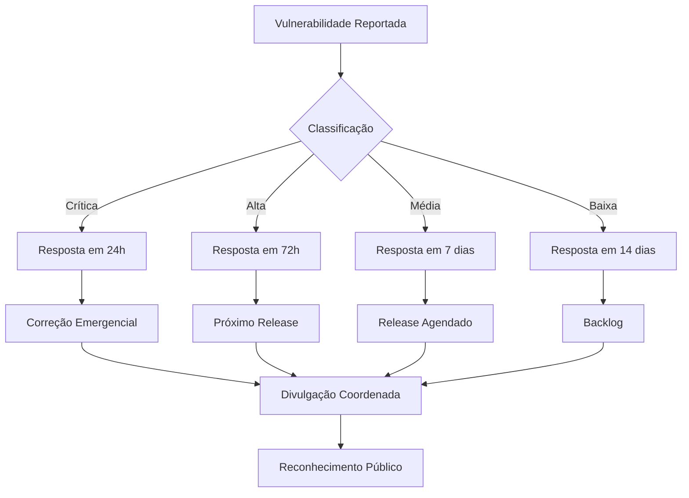
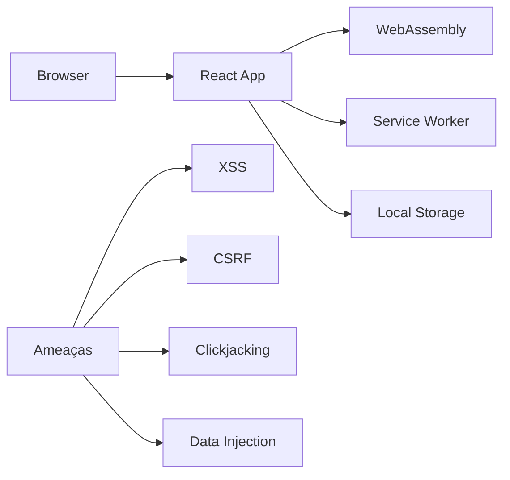
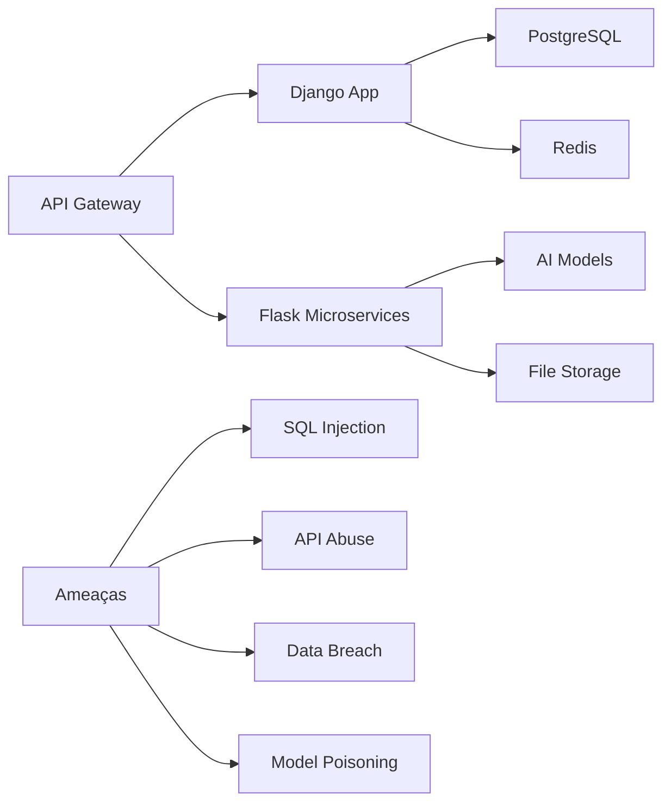
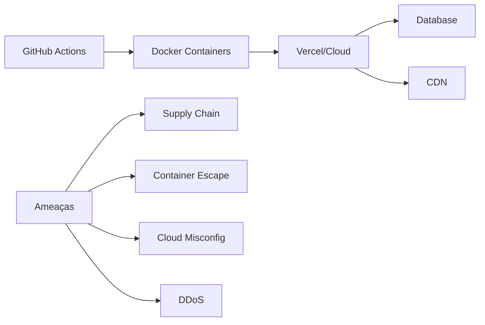

# Política de Segurança do Video AI Editor

## 🛡️ Nossa Promessa de Segurança

No Video AI Editor, levamos a segurança muito a sério. Este documento descreve nossas políticas e procedimentos para garantir a segurança de nossos usuários, dados e sistemas. Estamos comprometidos em:

- **Proteger dados dos usuários** contra acesso não autorizado
- **Manter a integridade do código** e dos sistemas
- **Responder prontamente** a relatórios de vulnerabilidades
- **Ser transparentes** sobre nossas práticas de segurança
- **Educar nossa comunidade** sobre melhores práticas de segurança

## 📋 Índice

- [Versões Suportadas](#versões-suportadas)
- [Relatório de Vulnerabilidades](#relatório-de-vulnerabilidades)
- [Modelo de Ameaças](#modelo-de-ameaças)
- [Segurança de Dados](#segurança-de-dados)
- [Segurança do Código](#segurança-do-código)
- [Segurança de Infraestrutura](#segurança-de-infraestrutura)
- [Resposta a Incidentes](#resposta-a-incidentes)
- [Melhores Práticas](#melhores-práticas)

### Cronograma de Suporte

- **Suporte Ativo**: Correções de segurança, bugs, e novas funcionalidades
- **Suporte Limitado**: Apenas correções de segurança críticas
- **Sem Suporte**: Nenhuma atualização de segurança fornecida

> **Recomendação**: Mantenha-se sempre na versão mais recente para garantir proteção máxima.

## 🚨 Relatório de Vulnerabilidades

### Como Reportar Vulnerabilidades

**🔒 Processo de Divulgação Responsável:**

1. **Não Abra Issues Públicas**
   - Nunca reporte vulnerabilidades em issues públicas ou discussões
   - Isso exporia a vulnerabilidade a atacantes

2. **Use Nossos Canais Privados**
   - **Email**: security@video-ai-editor.com
   - **GitHub**: [Private Vulnerability Report](https://github.com/LuwiEditor-AI/LuwiEditor-AI-Code/security/advisories/new)
   - **PGP Key**: [Disponível em nosso site](https://luwieditorai.xyz/security)

3. **Forneça Informações Detalhadas**
   ```markdown
   ## Resumo da Vulnerabilidade
   [Descrição concisa do problema]
   
   ## Passos para Reproduzir
   1. [Passo 1]
   2. [Passo 2]
   3. [Passo 3]
   
   ## Impacto Potencial
   [O que um atacante poderia fazer com esta vulnerabilidade]
   
   ## Ambiente de Teste
   - Versão: [x.x.x]
   - Sistema Operacional: [Windows/Linux/macOS]
   - Browser: [Chrome/Firefox/Safari]
   
   ## Evidências
   [Screenshots, logs, ou outros materiais de apoio]
   ```

### Processo de Resposta



### Classificação de Severidade

| Severidade | Tempo de Resposta | Exemplos |
|------------|------------------|----------|
| 🔴 Crítica | 24 horas | Execução remota de código, acesso total ao sistema |
| 🟠 Alta | 72 horas | Injeção de SQL, XSS armazenado, escalonamento de privilégios |
| 🟡 Média | 7 dias | XSS refletido, CSRF, informações sensíveis expostas |
| 🟢 Baixa | 14 dias | Configuração insegura, informações não sensíveis expostas |

### Programa de Recompensas

**🏆 Reconhecimento por Descobertas:**

- **Vulnerabilidades Críticas/Altas**: Hall da Fama, swag exclusivo, certificado
- **Vulnerabilidades Médias**: Hall da Fama, swag do projeto
- **Vulnerabilidades Baixas**: Hall da Fama, agradecimento público

> **Nota**: Não oferecemos recompensas monetárias atualmente, mas valorizamos imensamente as contribuições de segurança!

## 🎯 Modelo de Ameaças

### Superfície de Ataque

#### Frontend (React/PWA)


**Ameaças Principais:**
- **XSS (Cross-Site Scripting)**: Injeção de scripts maliciosos
- **CSRF (Cross-Site Request Forgery)**: Requisições forjadas
- **Clickjacking**: Ataques de interface maliciosa
- **Data Injection**: Injeção de dados maliciosos

#### Backend (Django/Flask)


**Ameaças Principais:**
- **SQL Injection**: Injeção de comandos SQL
- **API Abuse**: Uso malicioso das APIs
- **Data Breach**: Vazamento de dados
- **Model Poisoning**: Corrupção de modelos de IA

#### Infraestrutura


**Ameaças Principais:**
- **Supply Chain Attacks**: Ataques na cadeia de fornecimento
- **Container Escape**: Fuga de contêineres
- **Cloud Misconfiguration**: Configurações incorretas na nuvem
- **DDoS**: Ataques de negação de serviço

### Controles de Segurança

#### Autenticação e Autorização
```python
# Exemplo de implementação segura
from django.contrib.auth.decorators import login_required
from django.views.decorators.http import require_http_methods
from rest_framework.permissions import IsAuthenticated
from rest_framework.decorators import permission_classes, api_view

@api_view(['POST'])
@permission_classes([IsAuthenticated])
@require_http_methods(["POST"])
def process_video(request):
    # Verificação adicional de permissões
    if not request.user.has_perm('video.process'):
        return Response({'error': 'Permission denied'}, status=403)
    
    # Rate limiting
    if is_rate_limited(request.user):
        return Response({'error': 'Rate limit exceeded'}, status=429)
    
    # Processamento seguro
    return process_video_securely(request.data)
```

#### Validação de Entrada
```javascript
// Exemplo de validação no frontend
import DOMPurify from 'dompurify';
import { z } from 'zod';

const videoSchema = z.object({
  title: z.string().min(1).max(255).transform(val => DOMPurify.sanitize(val)),
  description: z.string().max(1000).optional(),
  effects: z.array(z.object({
    type: z.enum(['blur', 'brightness', 'contrast']),
    intensity: z.number().min(0).max(100)
  })).max(10)
});

function validateVideoInput(input) {
  try {
    return videoSchema.parse(input);
  } catch (error) {
    throw new SecurityError('Invalid input provided');
  }
}
```

## 🔐 Segurança de Dados

### Classificação de Dados

| Categoria | Tipo | Exemplos | Proteção |
|-----------|------|----------|----------|
| 🔴 Altamente Sensível | PII | Email, senha, biometria | Criptografia E2E, acesso restrito |
| 🟠 Sensível | Privacidade | Preferências, histórico de uso | Criptografia em repouso, controle de acesso |
| 🟡 Interno | Operacional | Logs, métricas, analytics | Criptografia em trânsito, acesso limitado |
| 🟢 Público | Geral | Documentação, código aberto | Sem restrições |

### Criptografia

#### Em Trânsito (TLS 1.3)
```yaml
# Configuração de segurança
tls_config:
  version: "TLSv1.3"
  ciphers:
    - "TLS_AES_256_GCM_SHA384"
    - "TLS_CHACHA20_POLY1305_SHA256"
    - "TLS_AES_128_GCM_SHA256"
  hsts:
    enabled: true
    max_age: 31536000
    include_subdomains: true
    preload: true
```

#### Em Repouso (AES-256)
```python
# Exemplo de criptografia de dados sensíveis
from cryptography.fernet import Fernet
from django.conf import settings

class DataEncryption:
    def __init__(self):
        self.cipher = Fernet(settings.ENCRYPTION_KEY)
    
    def encrypt(self, data):
        return self.cipher.encrypt(data.encode()).decode()
    
    def decrypt(self, encrypted_data):
        return self.cipher.decrypt(encrypted_data.encode()).decode()
```

### Controle de Acesso

#### Princípio do Menor Privilégio
```python
# Exemplo de implementação de RBAC
class Permission(Enum):
    VIEW_VIDEOS = "video.view"
    EDIT_VIDEOS = "video.edit"
    DELETE_VIDEOS = "video.delete"
    MANAGE_USERS = "user.manage"
    ACCESS_AI_FEATURES = "ai.access"

class Role(Enum):
    VIEWER = [Permission.VIEW_VIDEOS]
    EDITOR = [Permission.VIEW_VIDEOS, Permission.EDIT_VIDEOS]
    ADMIN = [Permission.VIEW_VIDEOS, Permission.EDIT_VIDEOS, 
             Permission.DELETE_VIDEOS, Permission.MANAGE_USERS]
    AI_USER = [Permission.VIEW_VIDEOS, Permission.EDIT_VIDEOS, 
               Permission.ACCESS_AI_FEATURES]
```

## 💻 Segurança do Código

### Análise Estática de Segurança (SAST)

#### Ferramentas Utilizadas
- **ESLint**: Para JavaScript/TypeScript
- **Bandit**: Para Python
- **Semgrep**: Análise semântica
- **CodeQL**: Análise avançada

#### Configuração de Exemplo
```yaml
# .github/workflows/security-scan.yml
security_scan:
  runs-on: ubuntu-latest
  steps:
    - name: Run Semgrep
      uses: semgrep/semgrep-action@v1
      with:
        config: >-
          p/security-audit
          p/owasp-top-ten
          p/cwe-top-25
    
    - name: Run Bandit
      run: |
        bandit -r . -f json -o bandit-report.json
    
    - name: Run ESLint Security
      run: |
        npx eslint . --ext .js,.jsx,.ts,.tsx \
          --config .eslintrc.security.js
```

### Análise Dinâmica de Segurança (DAST)

#### Testes de Penetração Automatizados
```javascript
// Exemplo de teste de segurança E2E
describe('Security Tests', () => {
  test('should prevent XSS attacks', async () => {
    const maliciousInput = '<script>alert("XSS")</script>';
    
    await page.fill('[data-testid="video-title"]', maliciousInput);
    await page.click('[data-testid="save-button"]');
    
    // Verifica se o script não foi executado
    const pageContent = await page.content();
    expect(pageContent).not.toContain('<script>');
  });
  
  test('should enforce rate limiting', async () => {
    for (let i = 0; i < 100; i++) {
      const response = await page.request.post('/api/process-video');
      if (response.status() === 429) {
        return; // Rate limit detectado
      }
    }
    throw new Error('Rate limiting not working');
  });
});
```

### Segurança de Dependências

#### Gerenciamento de Vulnerabilidades
```yaml
# dependabot.yml
version: 2
updates:
  - package-ecosystem: "npm"
    directory: "/frontend"
    schedule:
      interval: "daily"
    open-pull-requests-limit: 10
    reviewers:
      - "security-team"
    labels:
      - "security"
      - "dependencies"
  
  - package-ecosystem: "pip"
    directory: "/backend"
    schedule:
      interval: "weekly"
    reviewers:
      - "security-team"
    labels:
      - "security"
      - "dependencies"
```

## 🏗️ Segurança de Infraestrutura

### Segurança de Contêineres

#### Dockerfile Seguro
```dockerfile
# Use imagens base oficiais e específicas
FROM node:18-alpine AS builder

# Crie usuário não-root
RUN addgroup -g 1001 -S nodejs
RUN adduser -S nextjs -u 1001

# Instale dependências de forma segura
COPY package*.json ./
RUN npm ci --only=production && npm cache clean --force

# Copie código e defina permissões
COPY --chown=nextjs:nodejs . .
USER nextjs

# Exponha porta específica
EXPOSE 3000

# Health check
HEALTHCHECK --interval=30s --timeout=3s --start-period=5s --retries=3 \
  CMD curl -f http://localhost:3000/health || exit 1
```

#### Segurança de Kubernetes
```yaml
# security-context.yaml
apiVersion: v1
kind: Pod
metadata:
  name: secure-pod
spec:
  securityContext:
    runAsNonRoot: true
    runAsUser: 1001
    fsGroup: 1001
  containers:
  - name: app
    image: video-ai-editor:latest
    securityContext:
      allowPrivilegeEscalation: false
      readOnlyRootFilesystem: true
      capabilities:
        drop:
        - ALL
      volumeMounts:
      - name: tmp
        mountPath: /tmp
  volumes:
  - name: tmp
    emptyDir: {}
```

### Monitoramento e Detecção

#### Configuração de Monitoramento
```yaml
# prometheus-rules.yml
groups:
  - name: security.rules
    rules:
      - alert: HighErrorRate
        expr: rate(http_requests_total{status=~"5.."}[5m]) > 0.1
        for: 5m
        labels:
          severity: critical
        annotations:
          summary: "High error rate detected"
          description: "Error rate is {{ $value }} errors per second"
      
      - alert: SuspiciousActivity
        expr: rate(failed_login_attempts[5m]) > 10
        for: 2m
        labels:
          severity: warning
        annotations:
          summary: "Suspicious login activity detected"
          description: "Multiple failed login attempts detected"
```

## 🚨 Resposta a Incidentes

### Plano de Resposta

#### Fase 1: Detecção (0-1 hora)
```yaml
# automated-detection.yml
triggers:
  - name: "Security Alert"
    condition: "severity == 'high'"
    actions:
      - notify: "security-team@video-ai-editor.com"
      - create_incident: true
      - escalate: true
```

#### Fase 2: Análise (1-4 horas)
- **Triagem Inicial**: Avaliar severidade e impacto
- **Investigação**: Coletar logs e evidências
- **Contenção**: Isolar sistemas afetados

#### Fase 3: Contenção (4-8 horas)
- **Isolamento**: Desconectar sistemas comprometidos
- **Backup**: Preservar evidências
- **Comunicação**: Notificar partes interessadas

#### Fase 4: Erradicação (8-24 horas)
- **Remoção**: Eliminar malware ou acessos não autorizados
- **Patching**: Aplicar correções de segurança
- **Recuperação**: Restaurar sistemas seguros

#### Fase 5: Lições Aprendidas (1-2 semanas)
- **Análise Post-Mortem**: Documentar o incidente
- **Melhorias**: Implementar controles adicionais
- **Treinamento**: Educar equipe sobre lições aprendidas

### Comunicados de Incidentes

#### Template de Comunicação
```markdown
## 🚨 Incidente de Segurança - [TÍTULO]

### Status: [EM ANDAMENTO/RESOLVIDO]
### Severidade: [CRÍTICA/ALTA/MÉDIA/BAIXA]
### Início: [DATA/HORA]
### Última Atualização: [DATA/HORA]

### Resumo do Incidente
[Descrição clara e concisa do que aconteceu]

### Impacto
[Quais sistemas/usuários foram afetados]

### Ações Tomadas
[O que estamos fazendo para resolver]

### Recomendações para Usuários
[O que os usuários devem fazer]

### Próximos Passos
[Quando esperamos ter uma solução completa]

### Contato
Para dúvidas: security@video-ai-editor.com
```

## 📚 Melhores Práticas

### Para Desenvolvedores

#### Checklist de Segurança no Desenvolvimento
```markdown
## ✅ Antes de Fazer Commit
- [ ] Validação de entrada implementada
- [ ] Autenticação e autorização verificadas
- [ ] Logs não contêm informações sensíveis
- [ ] Segredos não estão no código
- [ ] Dependências atualizadas
- [ ] Testes de segurança executados

## ✅ Antes do Deploy
- [ ] Revisão de segurança completa
- [ ] Scan de vulnerabilidades passado
- [ ] Configurações de produção verificadas
- [ ] Backup de segurança realizado
- [ ] Plano de rollback preparado
```

#### Código Seguro - Exemplos
```python
# ❌ Inseguro
def get_user_videos(user_id):
    query = f"SELECT * FROM videos WHERE user_id = {user_id}"
    return execute_query(query)

# ✅ Seguro
def get_user_videos(user_id):
    query = "SELECT * FROM videos WHERE user_id = %s"
    return execute_query(query, [user_id])
```

```javascript
// ❌ Inseguro
function renderUserContent(content) {
  return `<div>${content}</div>`;
}

// ✅ Seguro
import DOMPurify from 'dompurify';

function renderUserContent(content) {
  const cleanContent = DOMPurify.sanitize(content);
  return `<div>${cleanContent}</div>`;
}
```

### Para Usuários

#### Dicas de Segurança
1. **Use Senhas Fortes**
   - Mínimo 12 caracteres
   - Combine letras, números e símbolos
   - Use gerenciador de senhas

2. **Ative Autenticação de Dois Fatores**
   - Use apps como Google Authenticator
   - Evite SMS quando possível

3. **Mantenha Software Atualizado**
   - Navegador atualizado
   - Sistema operacional com patches
   - Antivírus ativo

4. **Cuidado com Links Suspeitos**
   - Verifique URL antes de clicar
   - Desconfie de ofertas "boas demais"
   - Use verificação em duas etapas

### Para Administradores

#### Checklist de Segurança de Infraestrutura
```markdown
## 🔐 Configurações Básicas
- [ ] Firewall configurado
- [ ] Acesso SSH apenas com chaves
- [ ] Autenticação de dois fatores ativa
- [ ] Logs centralizados
- [ ] Backup automatizado
- [ ] Monitoramento ativo

## 🚨 Monitoramento
- [ ] Alertas de segurança configurados
- [ ] Detecção de intrusão ativa
- [ ] Análise de logs automatizada
- [ ] Testes de penetração regulares
- [ ] Auditoria de acessos
```

### Recursos Externos

- **OWASP Top 10**: https://owasp.org/www-project-top-ten/
- **CWE Mitre**: https://cwe.mitre.org/
- **NIST Cybersecurity Framework**: https://www.nist.gov/cyberframework
- **SANS Institute**: https://www.sans.org/

## 📝 Histórico de Mudanças

### Versões do Documento

- **v1.0** - 9 de outubro de 2025
  - Preocupações com a segurança
  - Melhores práticas de cibersegurança

---

## 🤝 Nosso Compromisso

A segurança é uma responsabilidade compartilhada. Estamos comprometidos em:

✅ **Transparência** sobre nossas práticas e incidentes
✅ **Colaboração** com a comunidade de segurança
✅ **Melhoria Contínua** de nossos controles e processos
✅ **Educação** de nossa equipe e usuários
✅ **Resposta Rápida** a preocupações de segurança

Juntos, podemos fazer do LuwiEditor-AI uma plataforma segura para todos.

---

<div align="center">
  <sub>
    🔒 Esta política é atualizada regularmente para refletir 
    as melhores práticas de segurança e as necessidades de nossa comunidade.
  </sub>
</div>

<div align="center">
  <sub>
    Última atualização: 9 de Outubro de 2025
    <br>
    Próxima revisão: 9 de Janeiro de 2025
  </sub>
</div>
- Compromisso público com segurança

Este documento estabelece uma base sólida para a segurança do projeto, sendo prático, acionável e alinhado com as melhores práticas da indústria!
